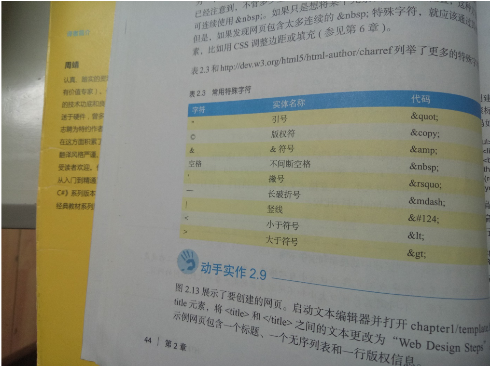
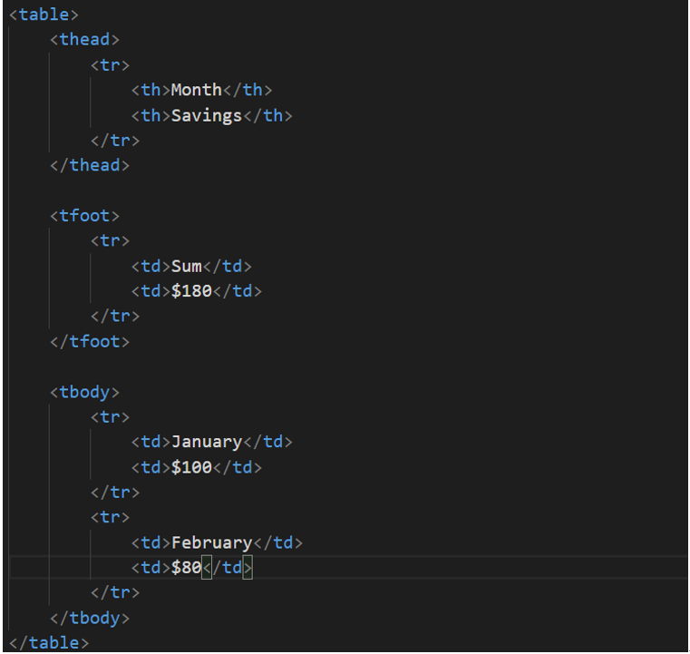
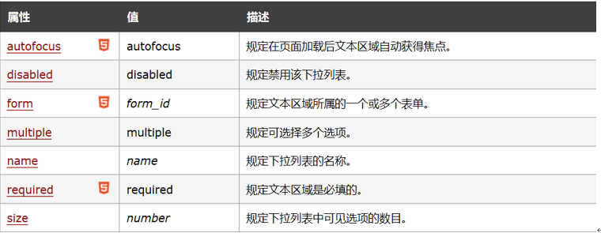
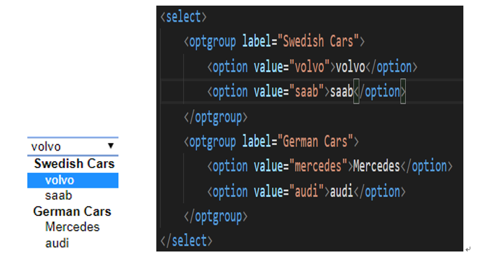
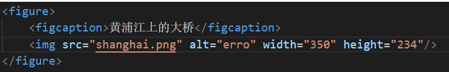

# Interviews 

##### 1.统一资源标识符(URL)和域名

如：<http://www.webdevbasics.net/chapter1/index.html>

HTTP协议://服务器计算机名.域名/目录名/文件名

域名用于在网上定位某个组织或其他实体。域名系统(DNS)的作用是通过标识确切的地址和组织类型，将互联网划分为众多逻辑的组别和容易理解的名称。

DNS将基于文本的域名和分配给设备的唯一IP地址联系起来

##### 2.浏览器输入一个URL,执行以下操作

①访问DNS

②获取相应的IP地址并将地址返回给浏览器

③浏览器根据这个IP地址向目标主机发送HTTP请求

④HTTP请求被浏览器接收

⑤必要的文件被定位并通过HTTP应答传回浏览器

⑥浏览器渲染并显示网页和相关文件

##### 3.网页模板

每个网页都包含html、head、title、meta、body元素

```
<!DOCTYPE html>
<html lang=”en”>
<head>
<title>网页标题</title>
<meta charset=”utf-8”>
</head>
<body>
....
</body>
</html>
```

##### 4.块元素

①标题元素：h1-h6六级，被浏览器渲染成块，标题上下自动添加空白

②段落元素：p,上下留空白

##### 5.短语元素

```
<abbr>：缩写   <b>:加粗文本 <cite>:引用文本 <code>:代码文本
<dfn>:定义文本，倾斜显示 <small>:小文本,小字号显示 
<strong>:强调文本，加粗显示 <sub>:下标文本  <sup>:上标文本
```

##### 6.有序列表

```
<ol>
  <li>Blue</li>
  <li>Red</li>
  <li>Teal</li>
</ol>
```

type属性改变列表序号类型

| 值    | 序号     |
| ---- | ------ |
| 1    | 数字(默认) |
| A    | 大写字母   |
| a    | 小写字母   |
| I    | 罗马数字   |
| i    | 小写罗马数字 |

##### 7.无序列表

```
<ul>
  <li>Blue</li>
  <li>Red</li>
  <li>Teal</li>
</ul>
```

##### 8.描述列表

```
<dl>标记开始,</dl>标记结束；每个要描述的术语以<dt>标记开始，</dt>标记结束；每项描述内容以<dd>开始，</dd>结束
```

##### 9.特殊字符



##### 10.结构元素header、nav、main、footer

header元素是块显示元素，包含网页文档或文档区域

nav元素建立一个导航链接区域

main元素包含网页文档的主要内容

footer元素的作用是为网页创建页脚

##### 11.锚元素和邮件链接

```
<a href="超链接地址"></a>
电子邮件链接<a href="mailto:邮件地址"></a>
```

##### 12.配置css的方法

①内联样式：将代码直接写入网页的主体区域

```
<p style="color:red;background-color:black;"></p>
```

②嵌入样式：在网页的页头区域之间进行定义

```
<head>
  <style>
      body {background-color:#E6E6FA;
             color:#191970;}
</style>
</head>

```

③外部样式：网页在页头区域使用link元素链接到文件

使用link元素将外部样式表与网页关联

```
<link rel="stylesheet"  href="样式文件位置"  type="text/css"/>
```

css遵循优先级规则，具体地说，样式按顺序应用，从最外层(外部样式)到最内层(HTML属性)，这样可以先设置全站通用的样式，并允许被更具体的样式(如比如嵌入或内联样式)覆盖

##### 13.css选择符和声明

选择符{声明属性:声明值}

如：body{color:blue}

##### 14.css配置颜色值

颜色名称、十六进制颜色值、十六进制短颜色值、十进制颜色值(RGB三元组)

p{color:red};    p {color:#FF0000};   p {color:#F00};   p {color:rgb(255,0,0)}

##### 15.css的class、ID和后代选择符

class选择符：.类名

id选择符: #id值

后代选择符: 如mian p {color:#00ff00;} 表示将main元素中的段落配置成绿色文本

##### 16.HTML 5确保的兼容性

###### (1)可以省略标记的元素

在HTML 5中，元素标记可以省略，具体来说分为‘不允许写结束标记’、‘可以省略结束标记’、‘开始标记和结束标记全部可以省略’

   □不允许写结束标记的元素(是指不允许使用开始标记和结束标记将元素括起来的形式，只允许使用<元素/>的形式进行书写):area、base、br、col、command、embed、hr、img、input、keygen、link、meta、param、source、track、wbr

□可以省略结束标记的元素有li、dt、dd、p、rt、rp、optgroup、option、colgroup、thead、tbody、tfoot、tr、td、th

   □可以省略全部标记的元素(是指该元素可以全部省略，即使该标记被省略了，该元素还是以隐式的方式存在的)有：html、head、body、colgroup、tbody

###### (2)具有boolean值的属性

​    对于具有boolean值的属性，例如disabled、readonly等，当只写属性而不指定属性值时，表示属性值为true,如果想要将属性值设为false,则可以不使用该属性

   另外如果想将属性值设为true，也可以将属性值设为属性名，或将空字符串设定为属性值。

```
<input type="checkbox" checked/>     //只写属性不写属性值，true
<input type="checkbox">             //不写属性，false
<input type="checkbox" checked="checked"/>     //属性值等于属性，true
<input type="checkbox’ checked=" "/>     //属性值等于空字符串，true

```

###### (3)省略引号

在指定属性值的时候，属性值两边加引号时既可以使用双引号，也可以使用单引号，HTML 5在此基础上做了一些改进，当属性值不包括空字符串、’<’、’>’、’=’、单引号、双引号等字符时，属性值两边的引号可以省略

```
 <input type=text/>    等价于<input type="text"/>
```

##### 17.map和area元素

map元素定义一个客户端图像映射。图像映射是指带有可点击区域的一幅图像。

area元素永远嵌套在map元素内部，用于定义图像映射中的区域

Note:img中的usermap属性可用map中的id或name属性，所以我们应该同时向map元素添加id或name属性。

| 属性     | 值                            | 描述                    |
| ------ | ---------------------------- | --------------------- |
| coords | 坐标值                          | 定义可点击区域(对数表敏感的区域)的坐标  |
| href   | URL                          | 定义此区域的目标URL           |
| nohref | nohref                       | 从图像映射中排除某个区域          |
| shape  | default  rect  cicr  poly    | 定义区域的形状               |
| target | _blank  _parent  _self  _top | 规定在何处打开href属性制定的目标URL |

```
<imgsrc="planets.jpg" border="0" usemap="#planetmap"alt="Planets" />
<mapname="planetmap" id="planetmap">
  <area shape="circle" coords="180,139,14" href ="venus.html"alt="Venus" />
  <area shape="circle" coords="129,161,10" href="mercur.html" alt="Mercury"/>
  <area shape="rect" coords="0,0,110,260" href ="sun.html" alt="Sun"/>
</map>
```

##### 18.base元素

base标签为页面上所有链接规定默认地址，没有结束标签，必须位于head元素内部

```
<head>
<base href="http://www.w3school.com.cn/i/" />
<base target="_blank" />
</head>
<body>
     //这里图片的地址应是：http://www.w3school.com.cn/i/eg_smile.gif
</body>
```

##### 19.thead、tbody、tfoot元素

thead标签定义表格的开头，用于组合HTML表格的表头内容;thead元素应该与tbody和tfoot元素结合起来使用

tbody元素用于对HTML表格中的主体内容进行分组；而tfoot元素用于对HTML表格的页脚内容进行分组

   Note:如果您使用thead、tbody以及tfoot元素，就必须使用全部的元素。他们出现的次序是:thead、tfoot、tbody,这样浏览器就可以在收到所有数据前呈现页脚了。而且必须在table元素内使用这些标签。



##### 20.select、optgroup、option元素

select元素可以创建单选或多选菜单，它是一种表单控件，可以用于在表单中接收用户输入



optgroup标签定义选项组，用于组合选项，位于select元素内部

option元素定义下拉列表中的一个选项，位于select元素内部

   

##### 21.HTML 5中新增的元素

###### (1)新增的结构元素

①section元素:表示页面中的一个内容区块，比如章节、页眉、页脚或页面中的其它部分 

②article元素:表示页面中的一块与上下文不相关的独立内容，比如论坛帖子、报纸文章、博客评论、用户评论等

③aside元素:表示article元素的内容之外的、与article元素的内容相关的辅助信息

④header元素:表示页面中一个内容区块或整个页面的标题

⑤footer元素:表示整个页面或页面中一个内容区块的脚注，一般来说，它会包含创作者的姓名、创作日期以及创作者联系信息 

⑥nav元素:表示页面中导航链接的部分

⑦figure元素:表示一段独立的流内容，一般表示文档主题流内容中的一个独立单元，使用figcaption元素为figure元素添加标题



⑧main元素表示网页中的主要内容，主内容区域指与网页标题或应用程序中本页面主要功能直接相关或进行扩展的内容<main></main>

###### (2)新增的其他元素

①video元素:用于定义视频，比如电影片段或其他视频流

②audio元素:用于定义音频，比如音乐或其他音频流

③embed元素:用于插入各种多媒体，格式可以是Midia、Wav、AIFF、AU、MP3等

④mark元素:主要用来在视觉上向用户呈现哪些需要显示或高亮显示的文字，典型应用就是在用户搜索结果中向用户高亮显示搜索关键词

⑤progress元素:表示运行中的进程

⑥meter元素:表示度量衡，仅用于已知最大值和最小值的度量 

⑦time元素:表示日期或时间，也可以同时表示两者 

⑧canvas元素:表示图形，比如图标和其他图像，这个元素本身没有行为，仅提供一块画布

⑨details元素:表示用户要求得到并且可以得到的细节信息，可以与summary元素结合使用

 

 

 

 

 

 

 

 

 

 

 

 

 

 

 

 

 

 

 