### 1.javascript及其特点

Javascript是一种轻量级的直译式编辑语言，基于ECMAScript标准，通常在html网页中使用javascript技术来为页面增强动态效果和功能。特点：

(1)脚本语言：是一种直译式脚本语言，无需编译，在程序运行中逐行解释使用；

(2)简单性：具有非常简单的语法；

(3)弱类性：无需定义变量的类型，所有变量的声明都可以用统一的类型关键字表示。在运行过程中，javascript会根据变量的值判断其实际类型；

(4)跨平台性：是一种web程序开发语言，只与浏览器的支持情况有关，与操作系统的平台类型完全无关；

(5)大小写敏感；

### 2.jquery及其特点

Jquery是一个轻量级的javascript函数库，其语法能让用户更方便地选取和操作HTML元素、处理各类事件、实现javascript特效与动画，并且能为不同类型的浏览器提供更便捷的API用于AJAX交互

特点：

(1)轻量级封装：网页使用jquery所需要引入的JS文件约有32kb,几乎不会影响页面的加载速度；

(2)化简Javascript:jquery的选择器简化了javascript查找DOM对象代码的复杂性，基本只需一行代码就可以查找各种HTML元素或更改指定元素的CSS样式；

(3)兼容CSS3；

(4)跨浏览器支持；

### 3.javscript变量声明：

javascript是一种弱类型脚本语言，无论是数字、文本还是其他内容，统一使用关键字var加上变量名进行声明，变量名命名规范：

（1）首位字符必须是字母、下划线或者美元符

（2）其他位置上的字符可以是下划线、美元符号、数字或字母

### 4.javascript有25个关键字和31个保留字

如果使用关键字或者和保留字作为变量名会报错

| Javascript关键字 |        |       |            |         |
| ------------- | ------ | ----- | ---------- | ------- |
| break         | case   | catch | continue   | Default |
| delete        | for    | else  | finally    | for     |
| function      | if     | in    | instanceof | New     |
| return        | switch | this  | throw      | Try     |
| typeof        | var    | void  | While      | with    |

 

 

| Javascript保留字 |          |              |        |           |
| ------------- | -------- | ------------ | ------ | --------- |
| abstract      | boolean  | byte         | char   | Class     |
| const         | debugger | double       | enum   | Export    |
| extends       | final    | float        | goto   | Implents  |
| import        | int      | Interfere    | long   | Native    |
| package       | private  | protected    | public | Short     |
| static        | super    | synchronized | throws | Transient |
| voliate       |          |              |        |           |

### 5.javascript有5种原始数据类型

分别是Number(数字)、Boolean(布尔值)、String(字符串)、Null(空值)和Undefined(未定义)；若输出的变量未声明或者使用关键字var声明过但未赋值，此时会显示undefined字样

### 6.String对象常见方法及示例

```
（1）var s='Hello';
     var slen=s.length；  //返回值为字符串的长度，5
```

#### （2）charAt()方法获取字符串指定位置上的单个字符

```
var msg = "Hello JavaScript";
var x = msg.charAt(0) //表示获取msg中的第1个字符，H
```

#### (3)charCodeAt()方法获取指定位置上单个字符的字符代码

```
var msg = "Hello JavaScript";
var x = msg.charAt(0) //表示获取msg中的第1个字符的字符代码(unicode)，返回值为72
```

#### （4）concat()方法将新的字符串内容连接到原始字符串上

```
var msg = "Hello";
var newMsg = msg.concat(" JavaScript"); //等价于var newMsg =msg + "JavScript"
alert(newMsg)  //返回值为"Hello JavaScript"
```

也可以直接使用+进行字符串连接

```
var s1="Hello";
var s2="Java";
var s3="Script";
var msg=s1.concat(s2,s3) // 等价于var msg=s1+s2+s3
```

#### (5)indexOf(原始字符串，要查找的字符)：

从序号为0的位置正序检索字符串内容，如若存在，其返回值为指定内容在原始字符串中的位置，否则不存在，返回-1；

lastIndeOf(原始字符串，要查找的字符): 从序号最大值的位置倒序检索字符串内容，如若存在，其返回值为指定内容在原始字符串中的位置，否则不存在，返回-1；

#### (6)查找与替换字符串

```
match(regExp):在参数regExp位置处填入一个正则表达式，例如match(/a/g)表示全局查找字母a,后面的小写字母g表示全局查找
search(regExp):在参数regExp处同样需要一个正则表达式，返回值是符合匹配条件的字符串索引值。
replace(regExp,replaceText)：替换匹配正则表达式的字符串内容
var msg="Happy NewYear 2019";
var result1=search(/y/)  //获取字符y所在的索引位置返回结果为4
var result2=match(/d/g) //全局查找\d(0-9的任意数字)，符合条件的所有字符串以逗号隔开，返回结果2，0，1，9
var result3=repalce(/a/g,"A")  //将字符串中所有的字符a全部用A替换，返回结果为HAppyNew YeAr 2019
```

#### (7)获取字符串片段

slice(start,end):start参数是需要删除的字符串的第1个字符位置，end参数位置是需要删除字符串的结束位置(不包括该位置上的字符串)，如果end参数省略，则默认填入字符串长度，如果填入的值为负数，表示从字符串的最后一个位置开始计算

substring(start,end):start参数是需要节选的字符串的第1个字符位置，end参数位置是需要节选字符串的结束位置(不包括该位置上的字符串)，如果end参数省略，则默认填入字符串长度，如果填入的值为负数，substring()会忽略负数，直接当0处理

```
var msg="happy";
var result=msg.substring(1,-1)； // substring(1,-1)会忽略负数，直接当0处理，因此实际上是substring(1,0)，由于此时结束位置比开始位置靠前，会自动转换为substring(0,1)返回值为h
var result2=msg.slice(1,-1)  // slice(1,-1)会将负数加上字符串长度换算成slice(1,4)返回值app
```

示例二：

```
var msg="Happy Birthday"
var result1=msg.substring(0,5) //返回值Happy
var result2=msg.slice(0,-9); //字符串长度为14，slice(0,-9)相当于slice(0,5)，返回值Happy
```

#### (8)toLowerCase():将字符串中所有字母转换为小写

toUpperCase()：将字符串中所有字母转换为大写

```
var msg="MerryChristmas";
var result1=msg.toLowerCase(); //返回值merry chritsma
var result2=msg.toUpperCase(); //返回值为MERRY CHRISTMAS
```

#### (9)split(separator)：把一个字符串分割成一个字符串数组 

####       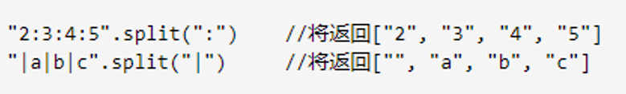 

### 7.Number类型：

该类型表示数字，可以是32位以内的整数，也可以是64位以内的浮点数，还可以使用科学记数法、八进制和十六进制地表示方法，

科学记数法：数值 e 倍数，其中数值可以是整数或者浮点数，倍数可以为负数 var x1=3.14e8(即314000000)；var x2=3.14e-8(即0.0000000314)

八进制的数需要用数字0开头，后面的数字只能跟0~7中的一个，varx=010(相当于十进制的8)

十六进制的数需要用数字0和字母x开头，后面的字符可以是0-9或A-F中的一个，大小写不限 var x=0xA(相当于十进制中的10)

浮点数：定义浮点数必须使用小数点，且小数点后边至少跟1位数字，可以省略var x=.15(等同于0.15)，浮点数可以用toFixed(digtal)方法规定小数点后保留几位数，并且该方法遵循四舍五入规律；var x=3.1415926; var result=x.toFixed(3) //返回值为3.142

Note:两个小数点1位浮点数相加会产生误差，需要乘以10后再相加

### 8.特殊Number值                                                                                       

(1)Number对象数值范围所允许的最大值Number.MAX_VALUE:1.8e308

(2)Number对象数值范围所允许的最小值Number.MIN_VALUE:5e-324

(3)Infinity:表示无穷大，有正负之分，当数值超过了javascript必须的范围内就为Infinity(超过上限)，-Infinity(超过下限)，分别为Number.POSTIVE_INTIFITY和Number.NAGATIVE_INFINITY

var x=9e3000  \\\返回值为Infinity

在比较数字大小时，无论原始数据为多少，认为结果为Infinity的两个数相等，同样两个-Infinity也是相等的

```
var x1=3e9000;
var x2=9e3000;
x1==x2 ; //返回值为true
```

Javascript中使用0作为除数不会报错，如果正数除以0返回值就是Infinity,负数除以0返回值就是-Infinity,特殊情况0/0的返回值为NaN(非数字)

Infinity不能与其他正常显示的数字进行数学计算，返回结果均为NaN,如：

```
var x=Number.POSITIVE_INFINITY;
var result=x+99; //返回值为NaN
```

(4)NaN :该数值用于表示数据转换为Number类型失败的情况

```
var x="red";
var result=Number(x)//返回值NaN，因为没有对应的数值可以转换
```

javascript还提供了用于判断数据类型是否为数值的方法isNaN(变量名称)，当数据无法正确转化为Number类型时返回真(true);其他情况返回假(false)

```
var x1="red";
var result1=isNaN(x1)//返回true
var x2="999";
var result2=isNaN(x2) ; //返回false
```

### 9.Boolean类型

该类型用于进行条件判断，其值只有两种true和false

### 10.Javascript对象类型

Javascript对象类型分为3种：

本地对象：Array对象、Date对象、RegExp对象、Object对象

内置对象：Global对象、Math对象、

宿主对象：HTML DOM（文档对象类型）、BOM（浏览器对象类型）

### 11.本地对象—Array

数组声明：var mobile=new Array(“苹果”，”三星”,”华为”)；

​      或：var mobile=[“苹果”，”三星”,”华为”];

Array对象包含length属性，用于获取当前数组的长度

Array对象方法：

#### (1)concat(array1,array2,…,arrayN)

用于在数组末尾处连接一个或多个数组，array1是必选参数，参数内容可以是数组也可以是数组内容

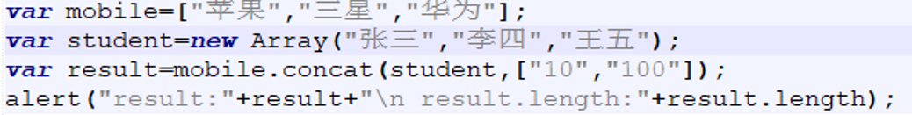

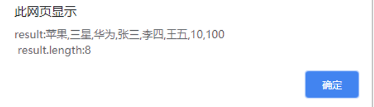

#### (2)join(separator)

把数组中所有元素用指定分隔符隔开，并在同一个字符串中显示出来，参数separator为可选参数，默认为逗号

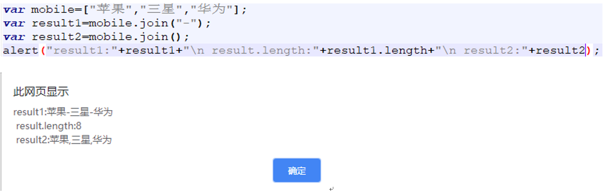

#### (3)pop()

删除数组的最后一个元素，并返回该元素的值，如果数组内容为空，则返回undefined,并不进行操作

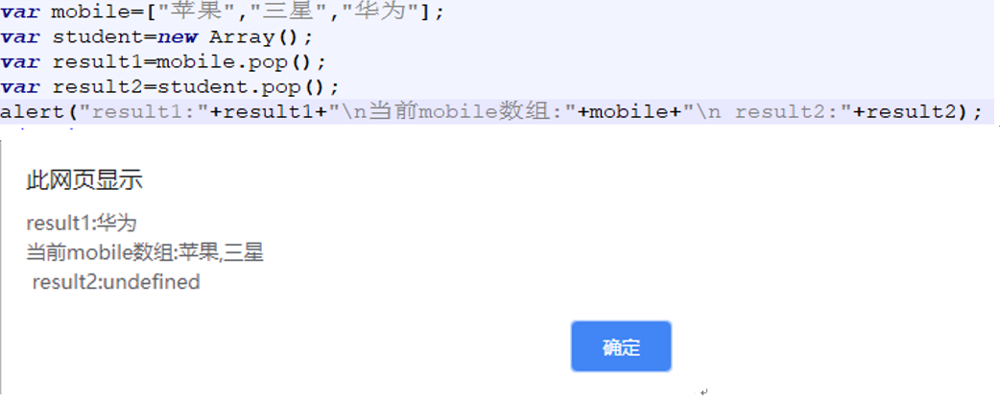

#### (4)push(element1,element2,…,elementN)

在数组的结尾处插入一个或多个元素，插入元素的个数不限(大于等于1，即element1为必选参数)，返回值为最新数组长度

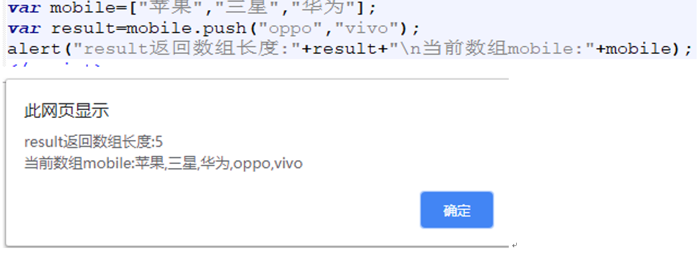

#### (5)reverse()

用于把数组中的所有的元素倒序重组，该方法直接更改原始数组，不会生成新数组

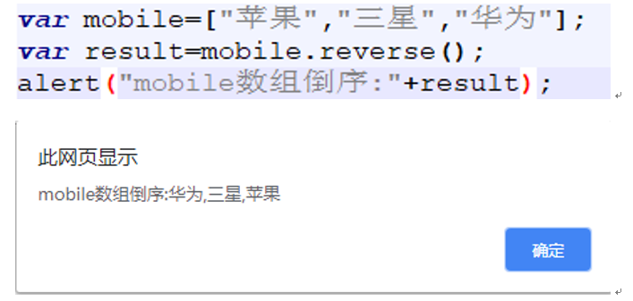

#### (6)shift()

删除数组中第一个元素，并返回该元素的值，如果数组为空，则返回undefined，并不进行操作

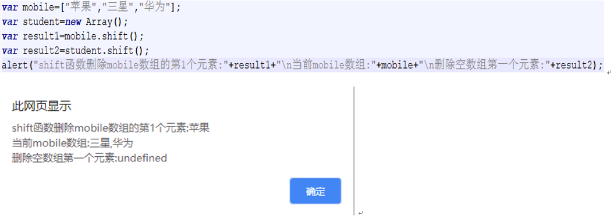

#### (7)slice(start,end)

用于返回数组中指定了开始和结束范围的一系列元素(不包括end元素本身)，start为必选参数，end为可选参数，被省略的-话表示一直选取到数组最后一元素结束，如果这两个参数都是负数，表示从数组末尾开始计算个数。 

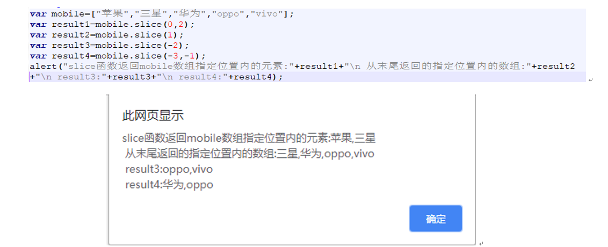

#### (8)toString()

用于把数组元素显示在同一个字符串中，并用逗号隔开，相当于没有指定join()方法的指定分隔符

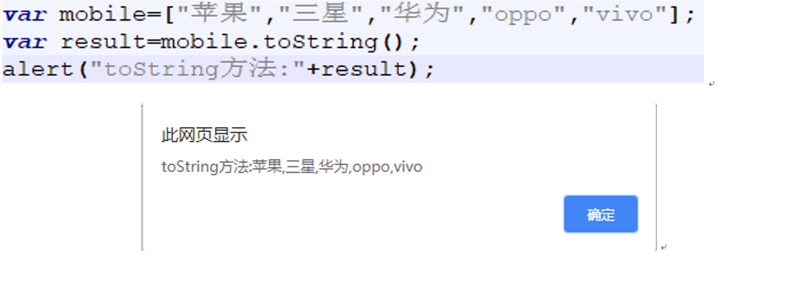

#### (9)unshift(element1,element2,…,elementN)

在数组的开头插入一个或多个元素，element1是必选参数,返回插入元素后数组的长度

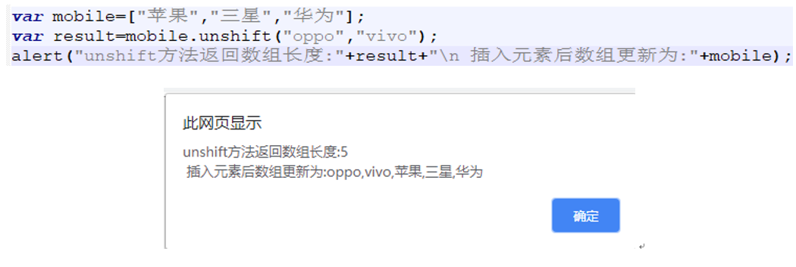

### 12.本地对象—Date

#### (1)初始化方式

```
new Date();  //获取当前的日期与时间
new Date(dateString); //使用表示日期时间的字符串定义时间，如May 10,2000 12:12:00
new Date(milliseconds)；//使用毫秒数定义时间
new Date(year,month,day,hours,minutes,seconds,
milliseconds); //自定义年月日时分秒毫秒，其中时分秒和毫秒数省略时默认为0

```

#### (2)Date():获取当前的日期和时间

#### (3)getDate():获取Date对象处于一个月里面的哪一日(1~31)

#### (4)getDay():获取Date对象处于星期几(0~6),其中0表示星期日

#### (5)getMonth():获取Date对象处于几月份(0~11)，0表示一月份

#### (6)getFullYear():获取Date对象的完整年份(4)位数

#### (7)getHours():获取Date对象的小时(0~23)

#### (8)getMinutes():获取Date对象的分钟(0~59)

#### (9)getSeconds():获取Date对象的秒(0~59)

#### (10)getTime():返回从1970年1月1日开始的毫秒数

#### (11)setDate():重新设置Date对象的日期，精确到哪一天

#### (12)setFullYear():重新设置Date对象的年份，年份必须为4位数的完整表达式

#### (13)setMonth():重新设置Date对象的月份(0~11) 

#### (14)setHours():重新设置Date对象的小时(0~23)

#### (15)setMinutes():重新设置Date对象的分钟(0~59)

#### (16)setSeconds():重新设置Date对象的秒(0~59)

#### (17)setTime():重新以1970年1月1日经历的毫秒数设置Date参数

#### (18)toDateString():将Date对象的日期部分转换为字符串

#### (19)toLocalDateString():根据本地时间格式将将Date对象的日期部分转换为字符串

#### (20)toLocalTimeString():根据本地时间格式将Date对象的时间部分转换为字符串

#### (21)toLocalString():根据本地时间格式将Date对象的日期和时间转换为字符串

#### (22)toUTCString():根据世界时间格式将Date对象的日期和时间转换为字符串

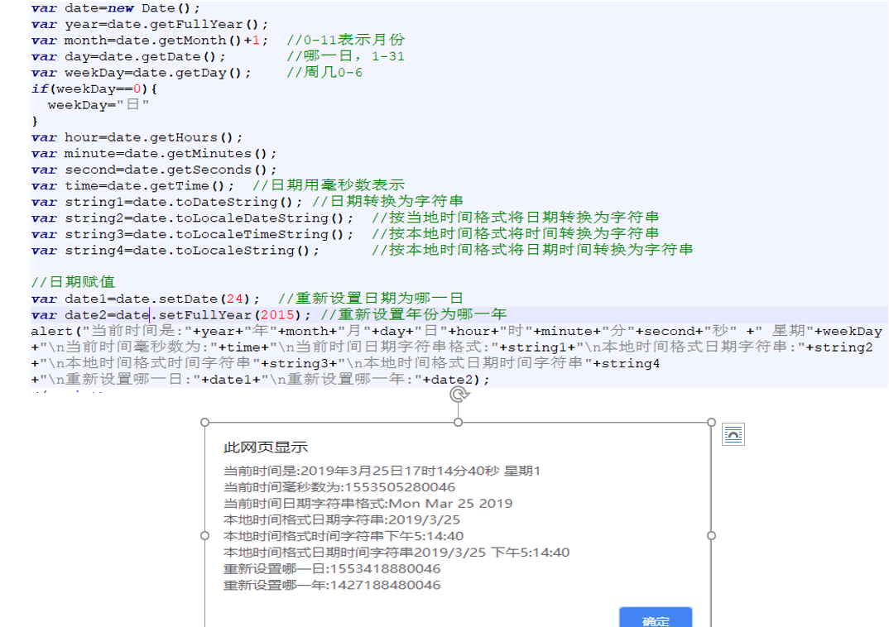

### 13.本地对象—RegExp(正则表达式)

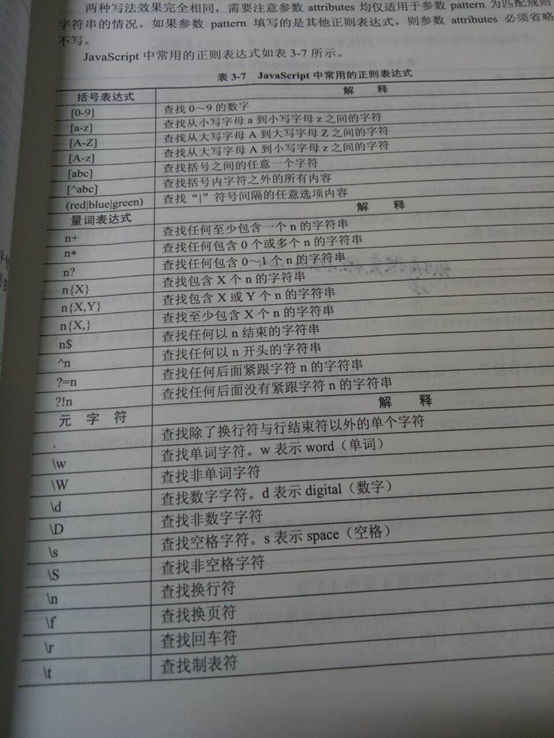

#### (1)语法格式

new RegExp(pattern,[,attributes])，参数含义如下:

pattern：字符串形式参数，用于规定正则表达式的匹配规则或填入其他正则表达式

attributes:为可选参数，包含属性值g,i,m，分别表示全局匹配，区分大小写匹配和多行匹配，attributes参数仅适用于参数pattern为匹配规则字符串的情况，如果pattern为其他正则表达式，参数attributes必须省略

如：var pattern=newRegExp([0,9],g)   可简写为var pattern= \[0-9] \g;

#### (2)检索文本的方法

①exec():用于检索文本中匹配正则表达式的字符串内容

RegExpObject.exec(string)该方法如果找到了匹配内容，则返回存放有检测结果的数组，否则返回null值

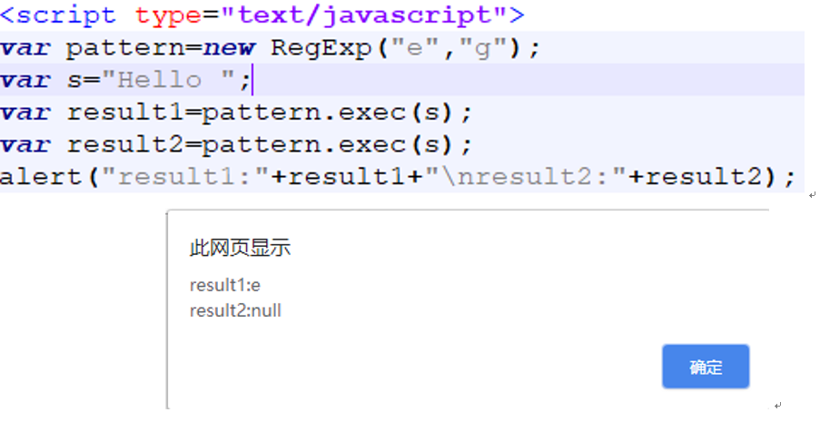

当 RegExpObject 是一个全局正则表达式时，exec() 的行为就稍微复杂一些。它会在 RegExpObject 的 lastIndex 属性指定的字符处开始检索字符串 string。当 exec() 找到了与表达式相匹配的文本时，在匹配后，它将把 RegExpObject 的 lastIndex 属性设置为匹配文本的最后一个字符的下一个位置。这就是说，您可以通过反复调用 exec() 方法来遍历字符串中的所有匹配文本。当 exec() 再也找不到匹配的文本时，它将返回 null，并把 lastIndex 属性重置为 0

②test()方法用于检测文本中是否包含指定的正则表达式内容，返回值为布尔值，格式如下：RegExpObject.test(string),其中RegExpObject指的是自定义的RegExp对象，参数string指的是需要被检索的文本内容。如果文本中包含RegExp对象的指定内容，返回值为true,否则返回值为false,该方法只用于无参数的情形，并且只检索一次，一旦检索就停止并提供返回值

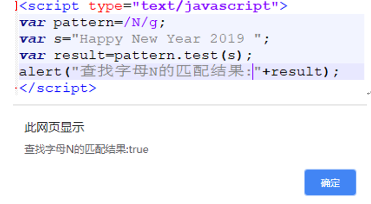

### 14.本地对象—Object对象

在javascript中所有类型都是对象，例如字符串、数组、数字等，这些带有方法的变量被称为对象

声明对象属性和方法

```
① var student=new Object();
  student.name="张三";
  student.id="201707010117";
  student.major="计算机科学与技术";
  student.study=function(){
  alert("开始学习");
};

②var student=new Object(){
   name:"张三",
   id:"20170010117";
   major:"计算机科学与技术"
}；

```

获取对象中指定的属性：

①对象变量名称**.**属性名称

②对象名[“属性名”]

还可以对对象的某个属性值赋值，来直接修改对象的属性值

 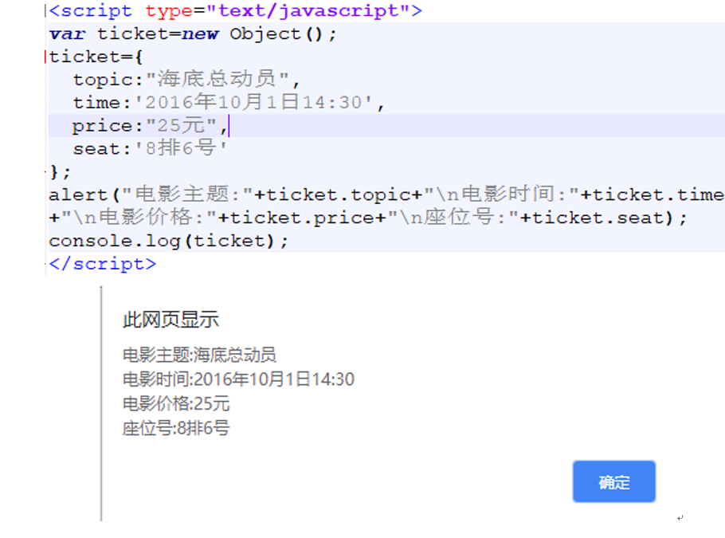 

### 15.内置对象—Global对象

JavaScript中Global对象又称为全局对象，其中包含的属性和函数可以用于所有的本地Javascript对象

表  Global对象的全局属性

| 属性名称      | 解释                                       |
| --------- | ---------------------------------------- |
| Infinity  | 表示正无穷大的数值，在数值超过了javascript规定的范围时使用       |
| java      | 表示引用的一个Java包，是Packages.java的缩写           |
| NaN       | 表示非数值(Not a Number),通常在其他类型转换为Number类型时使用 |
| Packages  | 表示JavaPackage对象，是所有java包的根               |
| undefined | 表示未声明或未赋值的变量值                            |

表Global对象的全局方法

| 属性名称                 | 解释                    |
| -------------------- | --------------------- |
| decodeURI()          | 解码URI                 |
| decodeURIComponent() | 解码URI组件               |
| encodeURI()          | 把字符串编码为URI            |
| encodeURIComponent() | 把字符串编码为URI组件          |
| escape()             | 对字符串进行编码              |
| eval()               | 将javascript字符串转换为脚本代码 |
| getClass()           | 返回java对象的类            |
| isFinite()           | 判断某个值是否为无穷大           |
| isNaN()              | 判断值是否为数字              |
| Number()             | 把对象的值转换为数字类型          |
| parseInt()           | 把字符串转换为整数             |
| parseFloat()         | 把字符串转换为浮点数            |
| String()             | 把对象的值转换为字符串           |
| unescape()           | 对使用eascpe()编码的字符串进行编码 |

### 16.内置对象—Math对象

在javacsript中Math对象用于数学计算，无须初始化创建，可以直接使用关键字Math调用其所有的属性和方法。

表Math对象的常用属性

| 属性名称    | 解释                    |
| ------- | --------------------- |
| E       | 返回算术常量e(约2.718)       |
| LN2     | 返回log以算术常量e为底的2的对数    |
| LN10    | 返回log以算术常量e为底的10的对数   |
| LOG2E   | 返回log以2为底的算术常量e的对数    |
| LOG10E  | 返回log以10为底的算术常量e的对数   |
| PI      | 返回圆周率Π的值(约为3.1415926) |
| SQRT1_2 | 返回数字2的平方根的倒数(约0.707)  |
| SQRT2   | 返回数字2的平方根(约为1.414)    |

表Math对象的常用方法

| 方法名称     | 解释                               | 使用示例                                     | 示例中result值 |
| -------- | -------------------------------- | ---------------------------------------- | ---------- |
| abs(x)   | 返回数字的绝对值                         | var x=-100;  var result = abs(x);        | 100        |
| ceil(x)  | 使用进一法返回整数值，即舍去小数点和后面的所有内容，整数部分加1 | var x = 3.1415;  var result = ceil(x);   | 4          |
| cos(x)   | 返回数字的余弦值，x是弧度值                   | var x = Math.PI/2;  var result = cos(x); | 0          |
| floor(x) | 使用去尾法返回整数值，即舍去小数点和后面的所有内容，整数部分不变 | var x = 3.1415;  var result = floor(x);  | 3          |
| max(x,y) | 返回两个数之间的最大值                      | var x=2,y=3;  var result = max(x,y);     | 3          |
| min(x,y) | 返回两个数之间的最小值                      | var x=2,y=3;  var result = min(x,y);     | 2          |
| pow(x,y) | 返回x的y次方                          | var x=2,y=3;  var result = pow(x,y)      | 8          |
| random() | 返回[0,1]的随机数                      | var result = random();                   | 0~1的随机浮点数  |
| round(x) | 返回数字四舍五入后的整数                     | var x = 3.1415;  var result = round(x);  | 3          |
| sin(x)   | 返回数字的正弦值，x是弧度值                   | var x = Math.PI/2;  var result = sin(x); | 1          |
| sqrt(x)  | 返回数字的平方根                         | var x = 9  var result = sqrt(x)          | 3          |
| tan(x)   | 返回数字的正切值，x是弧度值                   | var x = Math.PI/4;  var result = tan(x); | 1          |

 

### 17.JavaScript类型转换-转换为字符串

在javascript中，布尔值类型(Boolean)和数字类型(Number)均可使用toString()方法把值转换为字符串类型

(1) 布尔值类型(Boolean)的toString()只能根据初始值返回true或false

```
var x = true;
var result = x.toString(); //返回true
```

(2) 数字类型(Number)使用toString()方法有两种模式，即默认模式和基数模式

在默认模式中，toString()方法不带参数直接使用，此时无论整数、小数或者科学记数法表示的内容都会显示为十进制的数值

```
var x1 = 99;
var x2 = 99.90;
var x3 = 1.25e8;
var result1 = x1.toString(); //返回值为“99”
var result2 = x2.toString(); //返回值为“99.9”  如果小数点后面是以0结束，那么在转换成String类型时最末端的0都会被省略
var result3= x3.toString(); //返回值为“125000000”  使用科学记数法表示的数字会显示成计算后的十进制完整结果
```

在基数模式下，需要在toString()方法的括号内填入一个指定的参数，根据参数指示把原始数据转换为二进制、八进制或十六进制数

```
var x = 10;
var result1 = x.toString(2); //声明将原始数据转换为二进制数，返回值为“1010”
var result2 = x.toString(8); //声明将原始数据转换为八进制数，返回值为“12”
var result3 = x.toString(16); //声明将原始数据转换为16进制数，返回值“A”
```

### 18.JavaScript类型转换-转换为数字

JavaScript提供了两种将String类型转换为Number类型的方法，即parseInt()和parseFloat(),其中parseInt()用于将值转换为整数，parseFloat()用于将值转换为浮点数，这两种方法仅适用于将String类型的内容进行数字转换，其他类型的均为NaN

#### (1)parseInt()

parseInt()方法转换的原理是从左往右依次检查每个位置的字符，判断该位置上是否为有效数字，如果是则将有效数字转化为Number类型，直至发现不是数字的字符，停止检查工作

```
var x1 ="123hello";
var result1 =parseInt(x1); //返回值123，因为h不是有效数字，停止检查
var x2 = "hello";
var result2 =parseInt(x2); //返回值NaN,因为第一个字符h就不是有效数字，直接停止检查，返回NaN
var x3 = "3.1415";
var result3 =parseInt(x3); //返回值为3，因为小数点不是有效数字，停止检查
```

parseInt()方法还可以有一个参数，用于声明需要转换的数字是二进制、八进制、十进制还是十六进制

```
var x = "10";
var result1 = parseInt(x,2); //表示原始数据为二进制，返回值为2
var result2 = parseInt(x,8);//表示原始数据为八进制，返回值为8
var result3 = parseInt(x,10);//表示原始数据为十进制，返回值为10
var result4 = parseInt(x,16 );//表示原始数据为十六进制，返回值为16
```

#### (2)parseFloat()

parseFloat()方法转换的原理与parseInt()方法类似，都是从左往右依次检查每个位置的字符，判断该位置上是否为有效数字，如果是则将有效数字转化为Number类型，直至发现不是数字的字符，停止检查工作

```
var x1 ="hello3.14";
var result1 =parseFloat(x1); //返回值NaN，因为第一个字符h就不是有效数字，直接停止检查
var x2 ="3.14hello";
var result2 =parseFloat(x2); //返回值3.14,因为h不是有效数字，停止检查
var x3 = "3.14.15.926";
var result3 =parseFloat(x3); //返回值为3.14，因为如果同时出现多个小数点，只有第一个小数点是有效的，当遇到第二个小数点时停止检查
```

parseInt()和parseFloat()还有一个不同之处：parseFloat()方法只允许接收十进制的表示，而parseInt()方法允许转换为二进制、八进制和十六进制

对于八进制数，如果前面带有数字0的形式，会直接忽略0转换为普通十进制，如：

```
var x = "010";
var result1 = parseInt(x); //默认为八进制数，返回值为8
var result2 = parseFloat(x); //默认为十进制数，返回值为10
```

对于十六进制数，如果出现字母，则直接按照字面的意思认为是无效的字符串，如：

```
var x = "A";
var result1 = parseInt(x,16);  //parseInt()允许十六进制数，返回值为10
var result2 = parseFloat(x,16); //parseFloat()不允许十六进制数，返回值为NaN
```


### 19.JavaScript类型转换-强制类型转换

一些特殊的值无法使用toString()、parseInt()、parseFloat()方法进行转换，例如null、undefined等，此时可以使用JavaScript中的强制转换对其进行转换

在javaScript中，有3中强制类型转换函数：

Boolean(value):把指定的值强制转换为Boolean类型

Number(value):把指定的值强制转换为数值(整数或浮点数)

String(value):把指定的值强制转换为字符串

#### (1)Boolean()函数

在javaScript中的所有其它类型都可以使用类型转换函数Boolean()转换成布尔值，再进行后续的计算

(1)当需要转换的值为非空字符串时，Boolean()函数的返回值为true,当需要转换的值为空字符串时会返回false,如：

```
var result1 =Boolean("hello");  //非空字符串的返回值为true
var result2 =Boolean("");        //空字符串的返回值为false
```

(2)当需要转换的值为数字时，整数0的返回值为false,其余所有整数与浮点数的返回值为true,如：

```
var result1 =Boolean(0);      //数字0的返回值为false
var result2 =Boolean(999);   //非0整数的返回值为true
var result3 =Boolean(3.14);  //浮点数的返回值为true
```

(3)当需要转换的值为null或者undefined时。Boolean()函数的返回值均为false,如：

```
var result1 = Boolean(null);     //返回值为false
var result2 = Boolean(undefined); //返回值为false
```

(4)当需要转换的值本身就是布尔值时会转换为原本的值，如：

```
var result1 = Boolean(true);     //返回值为true
var result2 =Boolean(false);     //返回值为false
```

#### (2)Number()函数

在javaScript中Number()函数可以将任意类型的值强制转换为数字类型

（1）当需要转换的内容为符合语法规范的整数或小数时，Number()将调用对应的parseInt()和parseFloat()方法进行转换，例如：

```
var x =Number("2");          //返回值为整数2
var y =Number("2.9");    //返回值为浮点数2.9
```

（2）当需要转换的值为布尔值时,true会转换为整数1，false会转换为整数0，如：

```
var x =Number(true);    //返回值为整数1
var y =Number(false);   //返回值为整数0
```

（3）与直接使用parseInt()和parseFloat()方法进行数字类型转换不同的是，  如果需要转换的值后面跟随超过一个小数点或其他无效字符，Number()会返回NaN,如：

```
var x = "2.12.13";
var result1 = parseInt(x);         //返回值为整数2
var result2 =parseFloat(x);      //返回值为浮点数2.12
var result3 =Number(x);         //返回值为NaN
```

（4）当需要转换的值为null或undefined时，Number()函数分别返回0和NaN,如：

```
var x1 = null;         //null值
var x2;              //undefined值
var result1 = Number(x1);          //返回整数0
var result2 = Number(x2);          //返回NaN
```

（5）当需要转换的值为其他自定义对象时，返回值均为NaN,例如：

```
var student = new Object();
var result =Number(student);         //返回NaN
```

#### (3)String()函数

String()函数可以将任意类型的之强制转换为字符串类型并保留字面内容，这与toString()的转换方法类似。与toString()方法的不同之处在于，String()函数还可以将null、undefined类型强制转换为字符串类型，如：

```
var x = null;
var result = String(x);        //返回值为字符串“null”
var result2 =x.toString()；    //发生错误，无返回值
```

### 20.JavaScript运算符

#### (1)赋值运算符=

#### (2)算术运算符+、-、*、/、%

#### (3)逻辑运算符---逻辑非(!)、逻辑或(||)、逻辑与(&&)

##### (1)逻辑非

逻辑非运算符的返回值只能是布尔值，即true或false

##### (2)逻辑与

当两个条件均为布尔值时，逻辑与的运算结果也是布尔值；但是当其中某个条件的返回值不是布尔值，有可能出现其他返回值

在条件1和条件2本身均为布尔值的前提下，只有当条件一和条件二均为真的情况下，逻辑与的返回值才为真；另外还有一种特殊情况：当条件1为假时，无论条件2是什么内容(null、undefined、数字、对象)，最终值均为假，且不再对第二个条件进行判断;如果存在某个条件是数字类型，则先将其转换为布尔值再继续进行判断； 

| 运算数类型            | 示例                                       | 返回值               |
| ---------------- | ---------------------------------------- | ----------------- |
| 一个是对象、一个是布尔值     | var student =  new Object();  var result =  student && true | 返回对象类型，student    |
| 两个都是对象           | var student1  =new Object()； var student2 =  new Object()  ；var result =  student1 && student2 | 返回第二个对象  student2 |
| 一个是空值null,一个是布尔值 | var x = null  ；var result = x  && true   | null              |
| 存在NaN            | var x = 100 / 0  var result = x  && true | NaN               |
| 存在未赋值undefined   | var x;  var result = x  && true          | undefined         |

##### (3)逻辑或

在条件1和条件2本身均为布尔值的前提下，只有当两个条件均为假时，逻辑或的返回值才是假；另外还有一种特殊情况：当条件1为真时，无论条件2是什么内容(如null、undefined、数字、对象等)，最终返回值都是真，不会再判断第二个条件；如果存在某个条件是数字类型，则先将其转换为布尔值再继续判断

逻辑或的返回值也不一定是布尔值，如果其中某个条件的返回值不是布尔值，有可能出现其他返回值

| 运算数类型                   | 示例                                       | 返回值               |
| ----------------------- | ---------------------------------------- | ----------------- |
| 条件1为false,条件2为对象        | var student =  new Object();  var result =  false \|\| student | 返回对象类型，student    |
| 两个都是对象                  | var student1  =new Object() ； var student2 = new  Object()  ；var result =  student1 \|\| student2 | 返回第一个对象  student1 |
| 条件1为false,条件2为null      | var x = null  ；var result =  false \|\| x | null              |
| 条件1为false,条件2为NaN       | var x = 100 / 0  ；var result =  false \|\| x | NaN               |
| 条件1为false,条件2为undefined | var x  var result =  false \|\| x        | undefined         |

#### (4)关系运算符-- >、<、>=、<=，用于比较两个值的大小，返回值一定是布尔值

（1）数字间的比较

数字间的比价完全依据数学中比大小的规律，当条件成立时返回真，否则返回假

（2）字符串之间的比较

当两个字符串比大小时是按照从左往右的顺序依次比较相同位置上的字符，如果完全一样，则继续比较下一个

   如果两个字符串在相同位置上都是数字，则仍然按照数学上的大小进行比较

```
var x1= "9";
var x2= "1";
var result = x1>x2;          //返回true
```

  如果两个数字的位数不一样，仍然只对相同位置上的数字进行比较，不按照数学概念看整体数值大小

```
var x1= "9";
var x2= "10";
var result = x1>x2;       //返回true,字符串相同位置比较原则，可知9大于1
```

javaScript是一种大小写敏感的语言，如果相同位置上的字符大小写不同可以直接做出判断，大写字母的代码小于小写字母的代码；如果大小写相同，则按照字母表的顺序从左往右进行字符串的比较

（3）字符串与数字的比较

当字符串与数字比大小时，总是先将字符串强制转换为数字再进行比较

```
var x1="100";
var x2=99;
var result1=x1>x2 ;       //返回true
```

如果字符串中包含字母或者其他字符无法转换为数字，则直接返回假

```
var x1="hello";
var x2=99;
var result=x1>x2;      //返回false
```

#### (5)相等性运算符（==、!=、===、!===），用于判断两个数值是否相等，返回值一定是布尔值

（1）等于和非等于

如果两个值均为数字类型，则直接进行数学逻辑上的比较判断是否相等，若需要进行比较的数据存在其他数据类型，要先将运算符前后的内容转换为数字再进行比较

表格1 数据类型转换规则表

| 数据类型      | 示例           | 转换结果      |
| --------- | ------------ | --------- |
| 布尔值真      | true         | 1         |
| 布尔值假      | false        | 0         |
| 字符串（纯数字）  | “99”         | 99        |
| 字符串（非纯数字） | “99hello123” | NaN       |
| 空值        | null         | null      |
| 未定义的值     | undefined    | undefined |

表格2 相等性特殊情况

| 运算数类型                   | 示例                                       | 返回值   |
| ----------------------- | ---------------------------------------- | ----- |
| 其中一个为null,另一个为undefined | var x1 = null;  var x2;  var result =  (x1==x2) | true  |
| 两个值均为null               | var x1=null;  var x2=null;  var  result=(x1==x2); | true  |
| 两个值均为undefined          | var x1;  var x2;  var  result=(x1==x2);  | true  |
| 其中一个为数字，另一个为NaN         | var x1=5;  var  x2=parseInt(“a”);  var  result=(x1==x2); | false |
| 两个值均为NaN                | var  x1=parseInt(“a”);  var  x2=parseInt(“b”);  var  result=(x1==x2); | false |

（2）全等性和非全等性运算符

全等性运算符在执行判断前不进行任何类型转换，两个数值必须数据类型相同并且内容也相同才返回真

#### (6)条件运算符

变量=布尔表达式条件？结果1：结果2

```
var x1 = 5;
var x2 = 9;
var result =(x1>x2) ? x1:x2;            //返回9
```

表达式判断x1是否大于x2,如果为真则把变量x1赋值给result,否则把x2赋值给result

### 21.JavaScriptDom 和 BOM

JavaScript文档对象模型DOM和浏览器对象模型BOM的用法，在DOM部分主要包括对HTML元素的查找、动态创建、内容/属性修改

BOM部分主要包括了5种对象：

Window：浏览器窗口对象，其成员包括所有的全局变量、函数和对象

Screen：屏幕对象，通常用于获取用户可用屏幕的宽和高

Location：位置对象，用于获取当前页面的URL地址，还可以把浏览器重定向到指定页面

History：历史记录对象，其中包含了浏览器的浏览历史记录

Navigator：浏览器对象，通常用于获取用户浏览器的相关信息

### 22.文档对象模型-查找HTML元素

#### (1)通过id名称查找HTML元素

//根据id名称获取元素对象

var test =document.getElementById(“id名称”);

//获取元素内容

var result =test.innerHTML;

getElementById()方法遵照驼峰命名法，如果未找到该元素返回值为null;如果找到该元素，则会以对象的形式的返回

#### (2)通过标签名称查找HTML元素

document.getElementsByTagName(“标签名称”);

此时方法中的Elements是复数形式，因为要考虑到有可能存在多个元素符合要求。同样，如果未找到符合的元素，返回值为null;如果有多个符合条件的元素，则返回值是数组的形式

如：var p = document.getElementsByTagName("p");

​    var result = p[0].innerHTML;  //查找所有段落元素p,并获取第一个段落标签内部的文本内容

#### (3)通过类名称查找HTML元素

document.getElementsByClassName(“类名称”);

此时方法中的Elements是复数形式，因为要考虑到有可能存在多个元素符合要求。同样，如果未找到符合的元素，返回值为null;如果有多个符和条件的元素，则返回值是数组的形式

注：该方法在IE5、6、7、8版本中使用无效，为了考虑各个版本浏览器的兼容性，如果不能保证用户使用在IE5、6、7、8版本以外的浏览器，则不建议使用此方法来获取HTML元素

### 23.DOM HTML

#### (1)创建动态的HTML内容

在JavaScript中使用document.write()方法可以往HTML页面动态输出内容，

```
<body>
 <script>
    document.write("本段文字为动态生成"+"Hello world")
 </script>
</body>
```

#### (2)改变HTML元素内容

获取元素内容的语法结构：

var 变量名= 元素对象.innerHTML;

更改元素内容的语法结构：

元素对象.innerHTML = 新的内容；

#### (3)改变HTML元素属性

在JavaScript中还可以根据属性名称动态的修改元素的属性，语法结构如下：

元素对象.attribute = 新的属性值

例如更改id=”image”的图片地址属性

var img =document,getElementById("image");

img.src ="img/newpic.jpg";

还可以通过使用setAttribute()方法达到同样的效果

var img =document,getElementById("image");

img.setAttribute("src","img/newpic.jpg");

### 24.DOM CSS—改变HTML元素的CSS样式

语法结构：元素对象.style.属性 = 新的值；

如更改id=”test”的元素背景颜色为蓝色

var test =document,getElementById(“test”);

test.style.backgroundColor= “blue”；

上述代码可以连成一句，写法如下：

document.getElementById(“test”).style.backgroundColor= “blue”;

### 25.DOM事件

JavaScript可以在HTML页面状态发生变化时执行代码，这种状态的变化称为DOM事件

如用户单击button按钮触发单击事件的两种方式：

```
（1）<button onclick="alert("hi")">点我会弹出对话框  </button>
（2）<button onclick=test()>点我会弹出对话框</button>
  <script>
    function test(){alert("hi");}
  </script>
```

表格3  HTML常用事件一览表

| 事件属性        | 解释           |
| ----------- | ------------ |
| onabort     | 图像加载过程中被中断   |
| onblur      | 元素失去焦点       |
| onchange    | 域的内容被改变      |
| onclick     | 元素被鼠标左键单击    |
| ondbclick   | 元素被鼠标左键双击    |
| onerror     | 加载文档或图像时发生错误 |
| onfocus     | 元素获得焦点       |
| onkeydown   | 键盘按键被按下      |
| onkeypress  | 键盘按键被按下并松开   |
| onkeyup     | 键盘按键被松开      |
| onload      | 页面或图象被加载完成   |
| onmousedown | 鼠标按键被按下      |
| onmousemove | 鼠标被移动        |
| onmouseout  | 鼠标从当前元素上移走   |
| onmouseover | 鼠标移动到当前元素上   |
| onmouseup   | 鼠标按键被松开      |
| onreset     | 重置按钮被单击      |
| onresize    | 窗口或框架的大小被更改  |
| onselect    | 文本被选中        |
| onsubmit    | 提交按钮被单击      |
| onunload    | 退出页面         |

### 26.DOM节点

#### (1)添加HTML元素

添加HTML元素有两个步骤，先创建需要添加的HTML元素，然后将其追加带一个已存在的元素中

创建新元素：document.createElement(“元素标签名”);

使用appendChild()方法将创建好的元素追加到已存在的元素中

​        已存在的元素对象.appendChild(需要添加的新元素对象);

比如，创建一个新的段落标签p,追加到id=”test”的div标签中

var p =document.createElement(“p”);

var test =document.getElementById(“test”);

test.appendChild(p);

#### (2)删除HTML元素

删除已经存在的HTML元素也需要两个步骤：首先使用doucument.getElementById(“id名称”)方法获取该元素，然后使用removeChild()方法将其从父元素中删除

 若父元素有明确的id名称，同样可以使用getElementById()方法获取，如：已知父元素id名称的情况下删除其中id=”p01”的子元素

var test =document.getElementById(“test”);       //获取父元素

var p =document.getElementById(“p01”);        //获取子元素

test.removeChild(p);                           //删除子元素

若父元素无对应的id名称获取，可以使用子元素的parentNode属性获取其父元素对象，效果相同。如：在不知道父元素id名称的情况下删除其中id=”p01”的子元素

var p = document.getElementById(“p01”);

var test = p.parentNode();

test.removeChild(p);

### 27.Window对象

在JavaScript中，Window对象表示浏览器窗口，目前所有浏览器都支持该对象。JavaScript中的一切全局变量、函数和对象都自动成为Window对象的内容

   如用于判断变量是否为数字的全局方法isNaN()就是Window对象的方法，完整方法为window.isNaN().通常情况下，Window前缀可以省略不写

可以使用Window对象的innerWidth和innerHeight属性分别获取浏览器窗口的内部宽度和高度。innerWidth和innerHeight属性值显示的是页面初始加载完毕时的尺寸，如果手动更改了当前浏览器窗口的大小并刷新页面，这两个属性值会动态变化

### 28.Screen对象

在JavaScript中，window.screen 对象用于获取屏幕的可用宽度和高度，该对象在使用时通常省略window前缀，简写为screen，Screen对象的常用属性如下：availWidth:表示屏幕的可用宽度，默认单位为像素（px）

availHeight:表示屏幕的可用高度，默认单位为像素（px）

可用宽度和高度指的是去除界面上自带内容（如任务栏）后的实际可用的宽和高

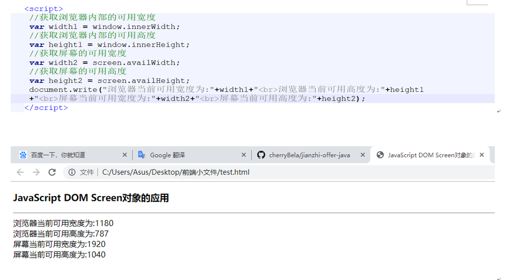

### 29.Location对象

在JavaScript中，window.location对象可用于获取当前页面的URL或者将浏览器重定向到新的页面。该对象在使用时通常省略window前缀，简写为location。location的href属性可以用于重定向到其他URL地址，如：

location.href(“新的地址”)

### 30.Histrory对象

在JavaScript中，window.history对象可用于获取当前页面的URL或者将浏览器重定向到新的页面。该对象在使用时通常省略window前缀，简写为history。通常使用History对象实现与浏览器上”后退”和“前进”按钮相同的功能：

back():返回上一个页面，相当于单击了浏览器上的“后退”按钮

forward():前进到下一个页面，相当于单击了浏览器上的“前进”按钮

### 31.Navigator对象

在JavaScript中，window.navigator对象可用于获取用户浏览器的一系列信息，例如浏览器的名称、版本号等。该对象在使用时通常省略window前缀，简写为navigator。

表格4  JavaScript Navigator对象常用属性一览表

| 属性名称           | 解释                                     |
| -------------- | -------------------------------------- |
| appCodeName    | 浏览器代码名，通常会显示为Mozilla                   |
| appName        | 浏览器名称，通常会显示为Netscape                   |
| appVersion     | 浏览器版本                                  |
| cookieEnabled  | 浏览器是否允许使用cookies.如果允许，返回true，否则返回false |
| javaEnabled    | 当前浏览器中是否启用了java                        |
| language       | 浏览器使用的首选语言                             |
| mimeTypes      | 在浏览器中注册的mime类型，返回值为数组                  |
| onLine         | 浏览器是否处于联网状态，如果处于联网状态，返回true,否则返回false  |
| plugins        | 浏览器中安装的插件信息，返回值为数组                     |
| platform       | 浏览器所在的操作系统                             |
| product        | 产品名称，通常显示为Gecko                        |
| userAgent      | 用户代理信息                                 |
| vendor         | 浏览器的品牌供应商                              |
| systemLanguage | 浏览器所在操作系统的首选语言，目前只有IE浏览器支持该属性          |

### 32.Jquery入门

文档就绪函数：为了避免文档在加载前就运行了jQuery代码导致潜在的错误，所有的jQuery函数都需要写在一个文档就绪函数中，例如当前HTML页面还没有加载完，就无法查询获取某HTML标签

$(document).ready(function(){

​    jQuery函数内容；

});

jQuery通常使用美元符号$作为简写方式，但在同时使用了多个JavaScript函数库的HTML文档中jquery有可能与其他同样使用$符号的函数(如Prototype)冲突，因此jQuery使用noConflict()方法自定义其他名称来替换可能产生冲突的$符号表达式

如使用jq表示$:var jq=jQuery.noConflict();

### 33.jQuery选择器与过滤器

jQuery选择器可用于快速选定HTML元素，包括基础选择器、属性选择器、表单选择器、层次选择器和CSS选择器；

jQuery过滤器包括基础过滤器、子元素过滤器、内容过滤器和可见性过滤器

### 34.jQuery选择器---基础选择器

表格5 jQuery基础选择器常见用法示例

| 选择器                                      | 描述               | 用法示例          | 示例描述                        |
| ---------------------------------------- | ---------------- | ------------- | --------------------------- |
| 全局选择器*                                   | 用于选择所有元素         | $(“*”)        | 选择文档中的所有元素                  |
| 元素选择器element                             | 用于选择指定标签名称的元素    | $(“p”)        | 选择文档中的所有段落元素                |
| ID选择器 #id                                | 用于选择指定id的元素      | $(“#test”)    | 选择文档中id=”test”的元素           |
| 类选择器 .class                              | 用于选择所有指定class的元素 | $(“.style01”) | 选择文档中class=”style01”的元素     |
| 多重选择器  selector1,  selector2,  …  selectorn | 用于选择符合条件的所有结果    | $(“p,h1,div”) | 选择文档中的所有段落元素p、标题元素h1和块元素div |

 

### 35.jQuery选择器---属性选择器

属性选择器用于选择具有指定属性要求的元素

 表格6 jQuery属性选择器常见用法示例

| 选择器                | 描述          | 用法示例               | 示例描述                 |
| ------------------ | ----------- | ------------------ | -------------------- |
| [attribute]        | 带有指定属性的元素   | $(“[alt]”)         | 所有带alt属性的元素          |
| [attribute=value]  | 属性等于指定值的元素  | $(“[href=’#’]”)    | 所有href属性值等于”#”的元素    |
| [attribute!=value] | 属性不等于指定值的元素 | $(“[href != ‘#’]”) | 所有href属性值不等于”#”的元素   |
| [attribute$=value] | 属性以指定值结尾的元素 | $(“[src$=’.png’]”) | 所有src属性值以”.png”结尾的元素 |

$(“img[src$=’.png’]”),找出页面中所有src属性以.png结尾的图像元素img

### 36.jQuery选择器---表单选择器

jQuery表单选择器可用于选择指定类型或处于指定状态的表单元素，常见用法如下表：

| 指定类型的表单元素 |                                      |                |
| --------- | ------------------------------------ | -------------- |
| 选择器       | 描述                                   | 用法示例           |
| :input    | 所有的input元素                           | $(“:input”)    |
| :text     | 选择type=”text”的input元素                | $(“:text”)     |
| :password | 选择type=”password”的input元素            | $(“:password”) |
| :radio    | 选择type=”radio”的input元素               | $(“:radio”)    |
| :checkbox | 选择type=”checkbox”的input元素            | $(“:checkbox”) |
| :submit   | 选择type=”submit”的input和button元素       | $(“:submit”)   |
| :reset    | 选择type=”reset”的input和button元素        | $(“:reset”)    |
| :button   | 选择type=”button”的input>和button元素      | $(“:button”)   |
| :image    | 选择type=”image”的input元素               | $(“:image”)    |
| :file     | 选择type=”file”的input元素                | $(“:file”)     |
| 指定状态的表单元素 |                                      |                |
| 选择器       | 描述                                   | 用法示例           |
| :enabled  | 所有启用的选择type=”submit”的input和button元素  | $(“:enabled”)  |
| :disabled | 所有被禁用的选择type=”submit”的input和button元素 | $(“:disabled”) |
| :selected | 下拉列表中处于选中状态的option元素                 | $(“:selected”) |
| :checked  | 所有被选中的单选按钮或者复选框                      | $(“:checked”)  |

### 37.jQuery选择器---层次选择器

#### (1)子元素选择器---只能选择指定元素的第一层子元素

语法结构：$(“parent>child”)

其中参数parent可以是任何一个有效的jQuery选择器，参数child填入的选择器筛选的必须是parent的第一层元素，如：

```
<p>这是一个<span><strong>测试</strong>段落</span>,用于测试子元素的层次</p>
```

在上述代码中，段落元素p的第一层子元素为span，而strong为span的第一层子元素，只能算是p的后代，因此使用子元素选择器只能是

```
$("p>span")或者$("span>strong")
```

$("ul.all>li")表示从class="all"的ul元素中选出所有的第一层li元素

#### (2)后代选择器---用于选择指定元素内包含的所有后代元素

语法结构：$(“ancestor descendant”)

其中参数ancestor可以是任何一个有效的jQuery选择器，参数descendant填入的选择器筛选的必须是parent的后代元素，该后代元素可以是参数parent的第一层子元素，也可以是其中子元素的后代，如：

```
<p>这是一个<span><strong>测试</strong>段落</span>,用于测试子元素的层次</p>
```

在上述代码中，段落元素p的第一层子元素为span，而strong为span的第一层子元素，属于p元素的后代，因此使用后代选择器选择其中的strong标签可以是只能是

```
$("p strong")或者$("span strong")
```

#### (3)后相邻选择器---用于选择与指定元素相邻的后一个元素

语法结构：$("prev+next")

其中参数prev可以是任何一个有效的jQuery选择器，参数next填入的选择器筛选的必须是与prev相邻的后一个元素

当需要选择的元素没有id名称或class属性值能选择的时候，可以考虑使用该方法先获取其相邻的前一个元素，然后再定位到需要的元素，如：

```
<p class="test">这是一个段落元素<p>
<p>这是第二个段落元素</p>
```

可以使用$("p.test+p")选择第二个段落元素p

#### (4)后兄弟选择器---用于选择与指定元素后面跟随的所有符合条件的兄弟元素

语法结构:$("prev~siblings")

其中参数prev可以是任何一个有效的jQuery选择器，参数sibling填入的选择器筛选的必须是位置在prev元素后面的兄弟元素

后相邻选择器和后兄弟选择器之间的不同之处在于：$("prev+next")

只能筛选紧跟在指定元素后面的下一相邻元素，而$("prev~siblings")可以筛选指定元素后面的所有符合条件的兄弟元素，可以是多元素。如：

```
<p class="test">这是一个段落元素。<p>
<p>这是第二个段落元素。</p>
<p>这是第三个段落元素。</p>
$("p.test~p").css("border","2px solid red")  //表示将class="test"的段落元素的所有兄弟段落的css设置为括号内的样式
```

### 38.jQuery选择器---CSS选择器

jQuery CSS选择器用于改变制定的HTML元素的CSS属性，语法结构如下：

$(selector).css(propertyName,value)

如：$("h1").css("background-color","gray")就是将所有h1标签的背景色改为灰色

### 39.jQuery过滤器---基础过滤器

| 过滤器     | 描述                      |
| ------- | ----------------------- |
| :first  | 用于选择第一个符合条件的元素          |
| :last   | 用于选择最后一个符合条件的元素         |
| :even   | 用于选择偶数的元素(元素从0开始计数)     |
| :odd    | 用于选择奇数的元素（元素从0开始计数）     |
| :eq()   | 用于选择指定序号的元素（元素从0开始计数）   |
| :gt()   | 用于选择大于指定序号的元素（元素从0开始计数） |
| :lt()   | 用于选择小于指定序号的元素（元素从0开始计数） |
| :not()  | 用于选择所有不符合指定要求的元素        |
| :header | 用于选择所有的标题元素，即h1--h6     |

#### (1)基础过滤器---:first和:last

:first过滤器语法结构

```
$(":first")
如：$("div:first")表示选择页面上第一个div元素
```

:last过滤器语法结构：

```
$(":last")
如：("p:last")表示选择页面上最后一个<p>元素
```

#### (2)基础过滤器---:even和:odd

   :even过滤器用于筛选符和条件的偶数个元素，序号从0开始计数，语法结构如下：

```
$(":even")
```

如：$(“tr:even”)表示筛选表格中的偶数行，由于:even过滤器是基于JavaScript数组原理，同样继承了从0开始计数的规则，因此上述代码表示筛选表格的第1、3、5以及更多行

   :odd过滤器用于筛选符合条件的奇数个元素，序号从0开始计数，语法结构如下：

```
$(":odd")
如：$("tr:odd")表示筛选表格中的奇数行即表格的2、4、6以及更多行
```

#### (3)基础过滤器---:eq()、:gt()、:lt()

:eq()过滤器用于选择指定序号为n的元素，序号从0开始，其语法结构为

```
$(":eq(index)")
参数index为指定的序号，若index为负数，则表示倒数第n个元素，
$(:eq(0))等同于$(":first")的效果
```

:gt()过滤器用于选择所有大于序号为n的元素，序号从0开始，其语法结构为$(“:gt(index)”),参数index为指定的序号，若index为负数，则表示大于倒数第n个元素

:lt()过滤器用于选择所有小于序号为n的元素，序号从0开始，其语法结构为$(“:lt(index)”),参数index为指定的序号，若index为负数，则表示小于倒数第n个元素

```
$("li:eq(2)")、$("li:gt(2)") 、$("li:lt(2)")分别表示查找序号等于2、大于2和小于2的li元素
```

#### (4)基础过滤器---:not()

:not()过滤器用于筛选所有不符合条件的元素，语法结构：$(“:not(selector)”)

$(“:not(p#test)”)表示筛选除id=”test”的段落元素之外的所有元素 

#### (5)基础过滤器---:header()

   :header()过滤器用于筛选所有的标题元素，从h1到h6均在此选择范围

### 40.jQuery过滤器---子过滤器

| 过滤器                                      | 描述                   | 用法示例                              | 示例解释                                     |
| ---------------------------------------- | -------------------- | --------------------------------- | ---------------------------------------- |
| :first-child                             | 用于选择所有父元素中的第一个子元素    | $(“p:first-child”)                | 在页面上所有包含段落元素p的父元素中筛选出每个父元素内部的第一个段落子元素p   |
| :last-child                              | 用于选择所有父元素中的最后一个子元素   | $(“p:last-child”)                 | 在页面上所有包含段落元素p的父元素中筛选出每个父元素内部的最后一个段落子元素p  |
| :nth-child(index),  index可以是具体的值，也可以是even、odd字样 | 用于选择所有父元素中第n个子元素     | $(“ul#item03 li:nth-child(3n+1)”) | 在id=”item03”的列表中筛选第3n+1项li子元素(其中n=0,1,2,…,3) |
| :nth-last-child()                        | 用于选择所有父元素中的到数第n个元素   | $(“li:nth-last-child(2))”)        | 在页面上所有包含li子元素的父元素中筛选出每个父元素内部的倒数第二个子元素    |
| :only-child                              | 用于选择所有父元素中有且仅有的一个子元素 | $(“div span:only-child”)          | 在所有只包含一个子元素的div父元素中查找span类型的子元素，如果父元素中包含了其他子元素，匹配失败 |

### 41.jQuery过滤器---内容过滤器

#### (1)内容过滤器---:contains()

:contains()用于筛选出所有包含指定文本内容的元素，语法结构：$(“:contains(text)”) 

$(“p:contains(‘hi’)”)表示选择所有文本内容包含”hi”字样的段落元素p

$(“div:contains(‘安徽’)”)表示筛选出所有文本内容包含”安徽”字样的块元素div

#### (2)内容过滤器---:empty

  :empty过滤器用于选择未包含子节点(子元素和文本)的元素，语法结构如下：

$(“:empty”)

用法示例:$(“td:empty”)表示选择所有无内容的表格单元格元素td

在HTML中部分元素标签直接默认不包含任何子节点，例如水平线br、换行标签br、图像标签img、表单标签input等

#### (3)内容过滤器---:parent

  :parent过滤器用于选择包含子节点(子元素和文本)的元素，语法结构如下“

$(“:parent”)

用法示例：$(“td:parent”)表示选择所有包含内容的表格单元格元素td,需要注意的是W3C规定段落元素p起码包含一个子节点，即使该元素中没有任何文本内容

#### (4)内容过滤器---:has()

   “has()过滤器用于选择包含指定选择器的元素，语法结构：$(“:has(selector)”)

用法示例：$(“div:has(table)”)表示选择所有包含表格的块元素div

​          $(“div:has(strong)”)表示选择包含strong标签的块元素div

### 42.jQuery过滤器---可见性过滤器

#### (1):hidden---用于筛选出所有处于隐藏状态的元素

语法结构：$(“:hidden”)

用法示例：$(“p:hidden”)表示查找所有隐藏的段落元素p

   如果元素在网站中不占用任何位置空间就被认为是隐藏的，具体有以下几种情况：

   （1）元素的宽度和高度明确设置为0

   （2）在元素的CSS属性中display值为none

   （3）表单元素的type属性设置为hidden

   （4）元素的父元素处以隐藏状态，因此子元素也无法一并显示出来

   （5）下拉列表中的所有选项元素option也被认为是隐藏的，无论其是否为selected状态

#### (2):visible---用于筛选出所有处于可见状态的元素

语法结构：$(“:visible”)

用法示例：$(“div#box”).find(“p:visible”)表示在id=”box”的块元素div中查找所有处于可见状态的段落元素p

需要注意的是，元素处以以下几种特殊情形时也被认为是可见状态：

（1）元素的透明度属性opacity为0，此时元素仍然占据原来的位置

​    (2）元素的可见属性visibility值为hidden，此时元素仍然占据原来的位置

 （3）当元素处于逐渐被隐藏的动画效果中时，到动画结束之前都被认为是可见的

（4）当元素除以逐渐被显示的动画效果时，从动画一开始被启动就认为是可见的

### 43.jQuery事件概述

   事件指的是HTML页面对不同用户操作动作的响应。当用户做某个特定操作时将触发页面对应的事件，例如单击按钮、移动鼠标、提交表单等，用户可以事先为指定的事件定义需要运行的脚本程序，事件被触发时将自动执行这段代码

   jQuery事件的语法格式：

​      $(selector).action(function(){

​           事件触发后执行的代码；

})

其中$(selector)可以是事件允许的jQuery选择器，action为需要替换为被监听的事件名称。如为段落元素p添加鼠标单击事件click，代码如下：

$(“p”).click(function(){

   alert(“段落元素被鼠标单击了!”);

})

常用的jQuery事件根据性质可以归纳为4类：

文档/窗口事件：页面文档或浏览器窗口发生变化时所触发的事件

键盘事件：用户操作键盘所触发的事件

鼠标事件：用户操作鼠标所触发的事件

表单事件：用户操作表单所触发的事件

 

 

 

 

​                                                                                                                                                                                                                                                                                                                                                                                                                                                                                                                                                           